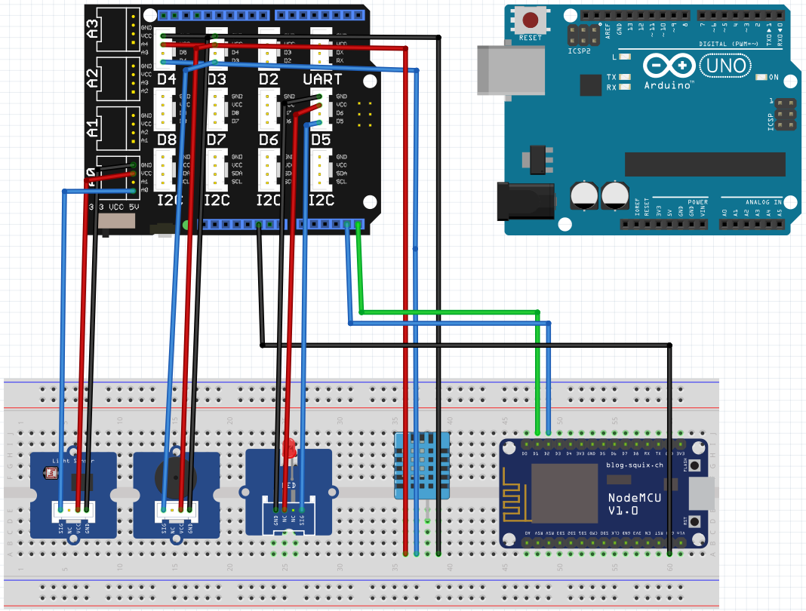

# Arduino Edge Demo

The Arduino Edge Demo is a project focused on integrating an Arduino board with an ESP8266 board to achieve Internet connection. The Arduino board is capable to read and write data to sensors and external devices (e.g. buzzer). The ESP8266 is connected to the Firebase via WiFi connection so it can store data in external database. To extend control and display capabilities it's integrated with a mobile Android application which allows to change parameters of devices connected to the Arduino board and to read data from these devices.

# Features

Arduino UNO:
- Reading data from external peripherals
- Writing data to external peripherals
- Sending I2C messages to NodeMCU on demand
- Reading I2C messages from NodeMCU on demand

NodeMCU:
- Connection to Internet via WiFI
- Connection to Google Firebase
- Reading I2C messages from Arduino UNO
- Writing data to Google Firebase
- Reading data from Google Firebase

Mobile app:
- Reading data from Google Firebase
- Writing data to Google Firebase

# Prerequisites

Project is targeted and has been tested on [Arduino Uno](https://store.arduino.cc/products/arduino-uno-rev3) and [NodeMCU](https://esp8266-shop.com/product/nodemcu-esp8266-esp-12e/) boards connected with each other. Arduino Uno is connected to external peripherals:
- [DHT11](https://www.adafruit.com/product/386) humidity and temperature sensor
- [light sensor (photoresistor)](https://wiki.seeedstudio.com/Grove-Light_Sensor/)
- [buzzer](https://wiki.seeedstudio.com/Grove-Buzzer/)
- [LED](https://www.seeedstudio.com/Grove-Red-LED.html)

It's optional but you might also want to have an [Arduino base shield](https://www.seeedstudio.com/Base-Shield-V2.html).

To compile and upload software on selected boards you will also need [Arduino IDE](https://www.arduino.cc/en/software).

## Arduino IDE

After downloading IDE you have to configure it and install additional libraries. Follow instructions below to properly setup your environment.

1. Some of used libraries are not available in a built-in manager by default. Go to `File -> Preferences -> Additional Boards Manager URLS` and add these repositories:
    - http://arduino.esp8266.com/stable/package_esp8266com_index.json
    - https://raw.githubusercontent.com/espressif/arduino-esp32/gh-pages/package_esp32_index.json

2. Go to `Tools -> Manage Libraries` and install:
    - `Firebase ESP8266 Client` by `Mobizt`
    - `DHT sensor library` by `Adafruit`

    ESP8266WiFi should be available automatically after selecting NodeMCU as a used board.

3. Select proper board, go to `Tools -> Board` and depending on which target you want to build choose one of following:
    - `Arduino AVR Boards -> Arduino UNO`
    - `ESP8266 Boards -> NodeMCU 1.0`

## Firebase

If you want to communicate with some database, first thing to do is creating it. For the purpose of this project I decided to use Firebase and I will walk you through creating one.

1. Visit [a Firebase console](https://console.firebase.google.com/), create an account and add a project.
    1. Step 1 of 3 - Enter your desired project name.
    2. Step 2 of 3 - Enable Google Analytics.
    3. Step 3 of 3 - Choose your Google Analytics accout and create project.

    Creating a project might take a while. Wait until it's finished and move on.

2. Create a Database:
    1. Go to Realtime Database in a Build section of left pane.
    2. Press `Create Database`.
    3. Choose Database location to `United States` - **It's very important, other locations WILL NOT be compatible with a mobile app**.
    4. Start in `locked mode` and `Enable` database.

3. Press `+` next to database URL and add a main key, it might contain spaces. You should also add endpoint for application data under the one you just created. Required by the app are:
    - `brightness`
    - `humidity`
    - `temperature`
    - `led`

    At the end your database structure should look like on the screenshot below. Depending on a version of application endpoint layout might be different but having less or more of them doesn't break anything. Missing endpoints will be created automatically and redundant ones will stay unused.

    

4. For later use save somewhere two values:
    1. Database URL which is visible above created endpoints.
    2. Authentication token available from a project settings: `gear icon -> Project Settings -> Service accounts -> Database secrets -> show (next to encrypted token)`.

## Mobile App

Exported project from [MIT App Inventor](http://ai2.appinventor.mit.edu/) is available in this repository in [mi_mobile_app](mit_mobile_app) directory. You can use it to modify application design or extend its functionalities. Unfortunately you are forced to import it to the app inventor since you have to provide your own Firebase values necessary to connect.

1. Once you log in to MIT App Inventor, import a project.
2. On the right pane with `Components` scroll to the very bottom and choose `FirebaseDB1`.
3. In the pane on the right you should see component's `Properties`. Provide Firebase Token and URL that you saved earlier. As a `Project bucket` type a name of your main database key (`ASB Arduino Project` on screenshot above).

# Circuit

Once you've prepared a software, you also have to properly connect hardware components with each other. To do this follow the schematic and table below. On the schematic, it's assumed that you have an Arduino base shield on top of your Arduino board but you can also connect each pin directly to the board, omitting a base shield.

Graphical representation:

Table with pin connections:
| Arduino UNO | NodeMCU | DHT Sensor | Light Sensor | LED     |
|-------------|---------|------------|--------------|---------|
| GND         | GND     |            |              |         |
| GND         |         | GND        |              |         |
| GND         |         |            | GND          |         |
| GND         |         |            |              | GND     |
| VCC         |         | VCC        |              |         |
| VCC         |         |            | VCC          |         |
| VCC         |         |            |              | VCC     |
| A0          |         |            | Analog Pin   |         |
| D4          |         | Data Out   |              |         |
| A4          | D1      |            |              |         |
| A5          | D2      |            |              |         |
| D5          |         |            |              | Data In |

# Build and flash

Once you've satisfied all prerequisites and connected hardware, you can move to setting up source code and compiling boards' software.

Before compiling make sure to set macros in `nodemcu_sketch.ino`:
- `FIREBASE_HOST` - Firebase URL
- `FIREBASE_AUTH` - Firebase Authentication Token
- `FIREBASE_BUCKET` - Firebase main key
- `WIFI_SSID` - WiFi network name
- `WIFI_PASSWORD` - WiFi password

After that connect a target board to PC, choose it in `Tools -> Board` and upload it with `Sketch -> Upload`. Do this for both Arduino UNO and NodeMCU.

If you did everything correctly, you should be able to see updated values in your mobile app.
